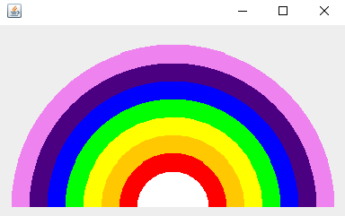

# Creating Rainbow in Java
## Combining Colors to make the sky rainbow pattern

[✔] Create two constant colors - INDIGO and VIOLET.
[✔] Create an array of colors and put "ROY G. BIV" plus two WHITEs.
[✔] In the constructor of Rainbow.java class, set background to WHITE.
[✔] Create method paintComponent with Graphics object.
    [✔] Create radius and set value of choice.
    [✔] Get center of X.
    [✔] Get center of Y.
    [✔] Loop through colors 
    [✔] Using object Graphics, setColor to created colors with the loop - 1 to get last color.
    [✔] Using object Graphics, fill the arc using fillArc method by setting the :-
        [✔] Parameter X to center of X
        [✔] Parameter Y to center of Y
        [✔] Parameter width to multiplicity of iteration and radius double
        [✔] Parameter height to multiplicity of iteration and radius double
        [✔] Parameter startArc to zero - No need for start angle because angle starts at 90 degrees
        [✔] Parameter arcAngle to 180 degrees in order to flatten the rainbow diagram

```
public class Rainbow extends JPanel {

    private final static Color VIOLET = new Color(238,130,238);
    private final static Color INDIGO = new Color(75,0,130);

    private Color[] colors = {Color.WHITE, Color.WHITE, Color.RED, Color.ORANGE,
                              Color.YELLOW, Color.GREEN, Color.BLUE, INDIGO, VIOLET};

    public Rainbow() {
        setBackground(Color.WHITE);
    }

    public void paintComponent(Graphics graphics) {
        int radius = 20;
        int centerX = getWidth() / 2;
        int centerY = getHeight() - 10;

        for (int i = colors.length; i > 0; i--) {
            graphics.setColor(colors[i - 1]);
            graphics.fillArc(centerX - i * radius, centerY - i * radius,
                            i * radius * 2, i * radius* 2, 0, 180);
        }
    }
}

```

### End Result


```
import javax.swing.*;

import static org.junit.jupiter.api.Assertions.*;

class RainbowTest {

    public static void main(String[] args) {

        Rainbow rainbow = new Rainbow();

        JFrame jFrame = new JFrame();
        jFrame.setDefaultCloseOperation(JFrame.EXIT_ON_CLOSE);
        jFrame.setVisible(true);
        jFrame.setSize(400, 250);
        jFrame.add(rainbow);
    }
}
```